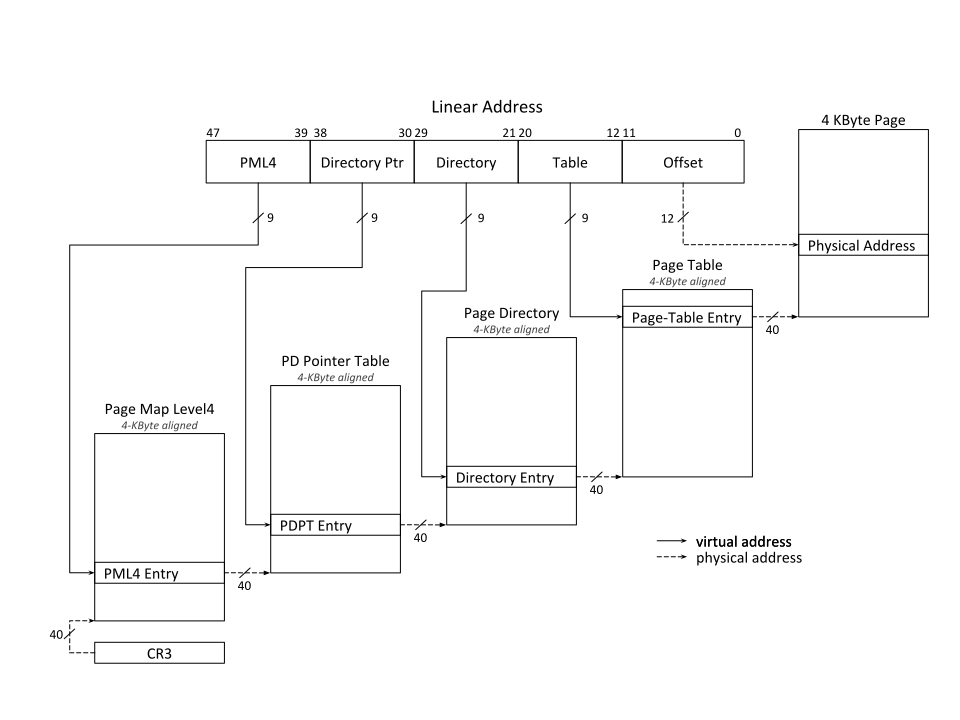

# x86 Paging

## 32-Bit Paging

Translates 32-bit linear addresses to 40-bit physical addresses.

If CR4.PSE = 0 or the PDE’s PS flag is 0, two levels of paging structures map the most significant bits of a 32-bit linear address to a 4-KBytes page.

If CR4.PSE = 1 and the PDE’s PS flag is 1, a single level of paging structures maps the most significant bits of a 32-bit linear address to a 4-MBytes page.

## 64-Bit Paging

Translates 48-bit linear addresses to 52 physical addresses.

Virtual addresses are sign-extended from 48 bits, and stored within a 64-bit pointer. Optionally, under control of a system register, the most significant 8 bits of a 64-bit pointer may hold a *tag* which will be ignored when used as a load/store address or the target of an indirect branch.
